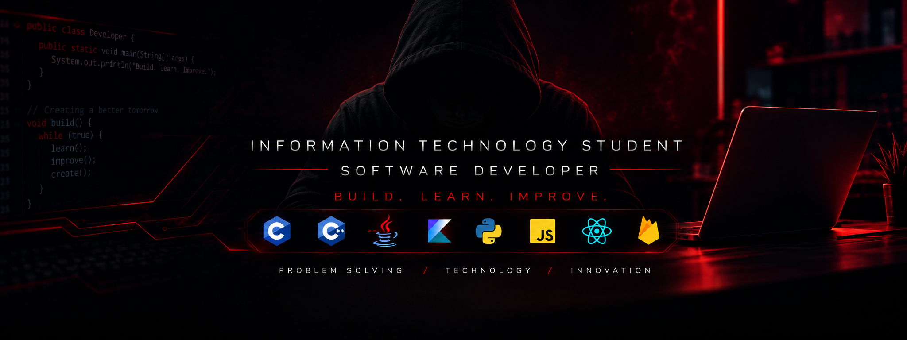

  

<h1 align="center">👋 Hi, I'm Blake</h1>

<h3 align="center">
  Information Technology Student • Software Developer
</h3>

  <i>Build. Learn. Improve.</i>

---

## 🧑‍💻 About Me

I'm an Information Technology student and aspiring software developer focused on building practical software, web applications, mobile applications, and technology-driven solutions.

I enjoy turning ideas into functional software, solving technical problems, experimenting with different technologies, and continuously improving my development skills through hands-on projects.

- 💻 Building practical software and web applications
- 📱 Exploring Android and cross-platform mobile development
- 🗄️ Working with relational and cloud databases
- 🔐 Building authentication and management systems
- 🤖 Exploring automation and AI-powered applications
- 🌐 Developing full-stack applications
- 🧠 Continuously expanding my software development knowledge
- 🔧 Improving my Git and GitHub workflow

---

# 💻 Tech Stack

### 👨‍💻 Programming Languages

  

  

---

### 🌐 Web Development

  

---

### ⚛️ Frameworks & Libraries

  

  

  AdonisJS • React Native • React Query • Socket.IO • Expo

---

### 📱 Mobile Development

  

---

### ⚙️ Backend & APIs

  

  REST APIs • JWT • Authentication • Authorization • JSON • CRUD • API Integration

---

### 🗄️ Databases

  

  MySQL • PostgreSQL • Microsoft SQL Server • SQLite • Firebase • Supabase

---

### 🖥️ Servers & Infrastructure

  

  Apache • Docker

---

### 🔧 Tools & Platforms

  

  Anaconda • Markdown • Cisco

---

# 📚 Currently Learning

- 🧩 Software Architecture
- ☕ Advanced Java
- 🐍 Python Development
- 📱 Android Development
- 🌐 Full-Stack Development
- 🔌 REST APIs
- 🗄️ Database Design
- 🔐 Authentication & Security
- 🐙 Git & GitHub
- 🧪 Software Testing
- 🧱 Clean Code & Maintainable Software

---

# 📊 GitHub Statistics

  
  

---

# 🧠 Development Philosophy

> **Build. Learn. Improve.**

I believe the best way to become a better developer is through continuous experimentation, practical problem-solving, and building real software.

Every project is an opportunity to learn something new, improve existing skills, and become a better developer.

---

# 📫 Contact

  📧 <b>Email:</b> YOUR_EMAIL@gmail.com

---

  <i>Always learning. Always building.</i>

